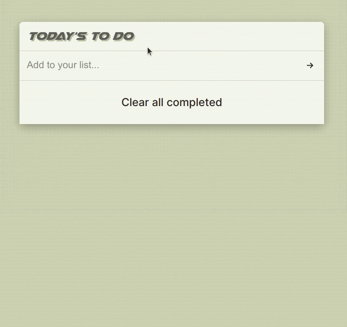

# TO DO LIST

> **To-do list** is a tool that helps you to organize your day. It simply lists the things that you need to do and allows you to mark them as complete.
> It was built as an introduction to web dev using ES6 and Webpack

## Built With

- Webpack
- 
- 
- 
- 

## Milestones

- Milestone 1: **list structure**
- Milestone 2: **improved style**
- Milestone 3: **crud operation**
- Milestone 4: **user input validation**
- Milestone 5: **final style touches**
- Milestone 6: **secure deploy**

## sneak peek

## Getting Started

**Prerequisites:** A Web Browser (preferably FireFox or Chrome)
To get a local copy up and running follow these simple example steps.

### **Option 1**

#### Use the live Website

[Awesome Books Website](https://sboursen.github.io/to-do-tasks/)

### **Option 2**

#### Set up your own copy locally

- Clone [the GitHub Repository](https://github.com/Sboursen/to-do-tasks)
- Go to the Project `cd to-do-tasks`
- Run `npm install` to install the _dependencies_
  \_ Run `npm start` to run the live server.

## About me

👤 **Soufiane Boursen**

- GitHub: [@Sboursen](https://github.com/Sboursen)
- Twitter: [@sboursen_dev](https://twitter.com/sboursen_dev)
- LinkedIn: [@sboursen](https://linkedin.com/in/sboursen)

## Contributors

Contributions, issues, and feature requests are welcome!

Feel free to check the [issues page](../../issues/).

## Show your support

Give a ⭐️ if you like this project!

## 📝 License

This project is [MIT](./MIT.md) licensed.
